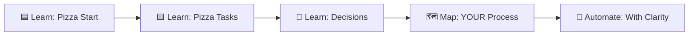

# 🍕 Pietro Pizzaiolo BPMN Tutor - BPMN Through Pizza

**Learn process mapping the fun way, then tackle your real complexity.**

## The Problem
People jump straight to automation without understanding their processes first. Result? Automated chaos.

## The Solution
A "pseudoagent" (system prompt) that teaches BPMN through pizza-making analogies, then becomes your process mapping sparring partner.

**Why pizza?** Everyone understands: Start (preheat oven) → Task (roll dough) → Task (add toppings) → End (serve). Same logic applies to any business process.

## How It Works

1. **Copy the system prompt** (`pietro-pizzaiolo-prompt.md`)
2. **Paste into Claude** (or any LLM)
3. **Learn BPMN basics** through 3 pizza levels (Margherita → Hawaii → Four Cheese)
4. **Apply to real processes** with your new process literacy

## Sample Learning Journey

## Philosophy

**Process literacy before automation.** Understand what you're doing before trying to automate what you think you're doing.

**Right context over more context.** Learn principles through concrete examples, not abstract theory.

**Platform-agnostic thinking.** BPMN works everywhere - from flowcharts to Power Automate to custom code.

## Most Reliable Win

Teams finally understand their own processes before trying to automate them.

---

*Created as exploration, not production software. Happy to hear what works/doesn't work.*

**Connect:** [steponthebridge.ch](https://www.steponthebridge.ch) | [LinkedIn](https://www.linkedin.com/in/achimimboden/)# PietroPizzaiolo-bpmn-tutor-agent
A Systemprompt that is using pizza as a Trojan horse for process literacy via BPMN-Mermaids.
